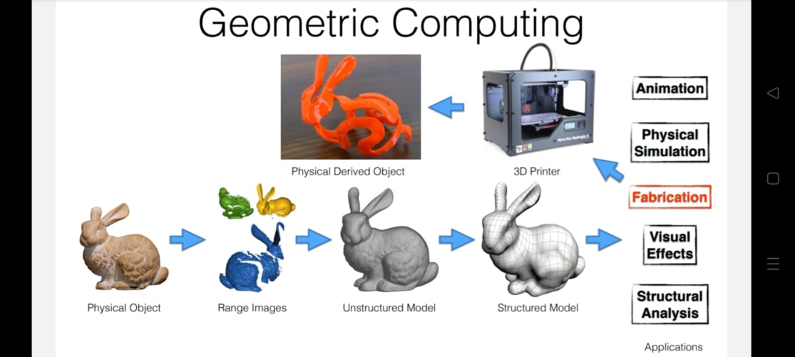

Algorithms

---

How to design, program and analyze geometric computing algorithms ?
These algorithms are used in shape modeling and geometic processing etc.
How to batch process large geometric data and integrate with deep learning pipline ?

What is geometric computing ? It is the intersectin of

1. Discreate Differential Geometry used for Surface and Volume representation and study it's differential properties and operators.

---

2. High Performance Computing uses different model of computation like vectorized, multi-core and distributed computation. GPU accelerators are examples of distributed computation.
3. Numerical Methods for solving PDEs which focused on real-time approximation and Irregular domains.
4. Human Computer Interface which aim for objective evaluation of resuts and architects and artists gets benifits from these research.
5. Physical Object
6. Range Images
7. Unstructured Model

---

[`image source`](https://geometryprocessing.github.io/geometric-computing-python/Intro.pdf)

---

4. Structured Model
   - Animation
   - Physical Simulation
   - Fabrication : 3D Printer takes inputs as physically derived object
   - Visual Effects
   - Structural Analysis

There are few libraries in python which are used for geometric computing

1. [MeshPlot](https://skoch9.github.io/meshplot/)

---

2. [Interactive Geometric Library(libigl)](https://libigl.github.io/)
3. [Wild Meshing(TetWild)](https://wildmeshing.github.io/)
4. [PolyFEM](https://polyfem.github.io/)

How graph data structure models the triangle meshes as discritize surfaces ?

---

## References

1. [Geometric Computing with Python](https://geometryprocessing.github.io/geometric-computing-python/)
2. [Interactive Geometric Library](https://libigl.github.io/libigl-python-bindings/)
3. [Geometry processing - Wikipedia](https://en.wikipedia.org/wiki/Geometry_processing)
